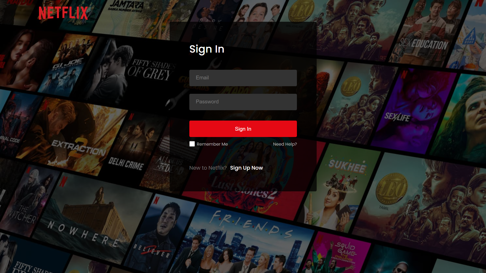
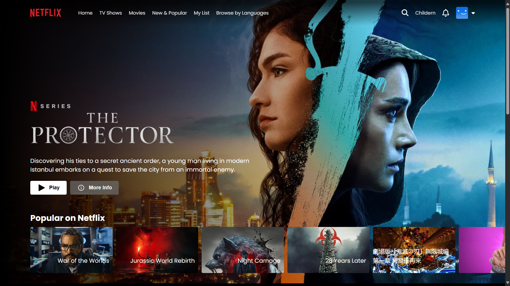
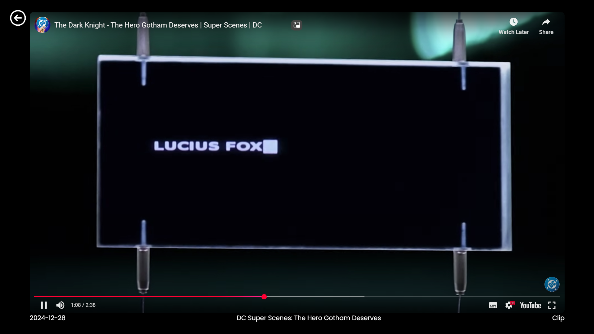

# 🎬 Netflix Clone
🔗 **Live Preview:** [https://flix-clone14121.netlify.app/](https://flix-clone14121.netlify.app/)


Welcome to the **Netflix Clone** project! 🍿  
This is a fully responsive and functional clone of Netflix built using **React.js**, **Firebase**, and **TMDB API**.

---

## 🚀 Features

- ✅ Netflix-style modern UI/UX
- 🔐 Firebase Authentication (Login/Sign Up)
- 🧰 Browse movies by categories (Trending, Top Rated, etc.)
- 📡 TMDB API integration for real-time data
- ▶️ Play trailers directly from the app
- 💻 Fully responsive for desktop & mobile
- ✨ Smooth transitions and hover effects

---

## 🛠️ Tech Stack

- ⚛️ React.js
- 🔥 Firebase (Auth + Hosting)
- 🎥 TMDB (The Movie Database) API
- 🎨 CSS3

---

## 📸 Screenshots

### 🏠 Login Page



---

### 🔐 Home Page



---

### 📱 Player View



---

## 🔧 Installation

To run this project locally:

1. 📥 Clone the repository
   ```bash
   git clone https://github.com/Pranav-Nanegaonkar/netflix-clone.git
   cd netflix-clone
   ```

2. 📦 Install dependencies
   ```bash
   npm install
   ```

3. 🔑 Create a `.env` file and add your Firebase config & TMDB API key:
   ```env
   REACT_APP_FIREBASE_API_KEY=your_api_key
   REACT_APP_FIREBASE_AUTH_DOMAIN=your_auth_domain
   REACT_APP_FIREBASE_PROJECT_ID=your_project_id
   REACT_APP_FIREBASE_STORAGE_BUCKET=your_storage_bucket
   REACT_APP_FIREBASE_MESSAGING_SENDER_ID=your_sender_id
   REACT_APP_FIREBASE_APP_ID=your_app_id
   REACT_APP_TMDB_API_KEY=your_tmdb_key
   ```

4. ▶️ Start the app
   ```bash
   npm start
   ```

---

## 🌐 Live Demo

🚀 [Click here to view the live site](https://your-deployment-link.com)  
> _(Replace with your Firebase or Vercel/Netlify deployed link)_

---

## 🧠 What I Learned

- Working with React components & hooks
- Managing authentication with Firebase
- Calling third-party APIs and displaying data
- Responsive design techniques
- Hosting a React app on Firebase

---

## 🙌 Acknowledgements

- [TMDB API](https://www.themoviedb.org/)
- [Firebase](https://firebase.google.com/)
- UI inspired by Netflix 🎞️

---

## 📫 Contact

👤 **Pranav Nanegaonkar**  
📧 [YourEmail@example.com](mailto:youremail@example.com)  
🔗 [GitHub Profile](https://github.com/Pranav-Nanegaonkar)

---

> Made with ❤️ by Pranav Nanegaonkar
